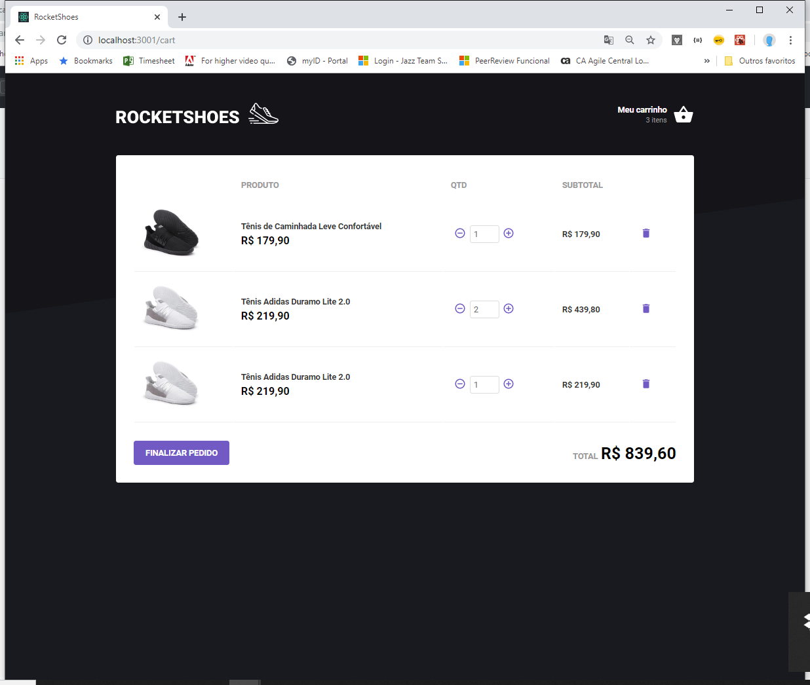

<h1 align="center" >
    
  Bootcamp 9.0 da <a text-decoration="none" href="https://rocketseat.com.br">:rocket: Rockeseat</a> - Módulo 7: Arquitetura Flux
</h1>
<h2 align="center">
    
</h2>

<blockquote align="center">“Feito é melhor doque perfeito!"</blockquote>

  

  
  

  

  <a href="#1---sobre-o-módulo">Sobre o desafio</a>&nbsp;&nbsp;&nbsp;|&nbsp;&nbsp;&nbsp;
  <a href="#2---tecnologias">Tecnologias</a>&nbsp;&nbsp;&nbsp;|&nbsp;&nbsp;&nbsp;
  <a href="#3---funcionalidades">Funcionalidades</a>&nbsp;&nbsp;&nbsp;|&nbsp;&nbsp;&nbsp;
  <a href="#4---apresentação">Apresentação</a>&nbsp;&nbsp;&nbsp;|&nbsp;&nbsp;&nbsp;
  <a href="#5---executar-aplicação">Executar aplicação</a>

## 1 - Sobre o módulo

Neste modulo foi desenvolvida uma aplicação web de um carrinho de compras. Toda estrutura de estado do carrinho de compras foi feito com a aplicação da arquitetura Flux através do uso das bibliotecas Redux e Redux Saga.

## 2 - Tecnologias

O Projeto desenvolvido em ReactJS com aplicação de diversas tecnologias e bibliotecas.

  - redux
  - redux saga
  - axios
  - jason-server (Simulador de backend)
  - prop-types
  - react-icons
  - styled-components
  - eslint
  - prettier
  - editorconfig
  - reactotron

## 3 - Funcionalidades

  - Listagem de produtos. Os podutos são recuperados do jason-server.
  - Inclusão dos produtos no carrinho de compras.
  - Alteração da quantidade de produtos incluidos no carrinho.
  - Alteração da quantidade de cada item no carrinho.
  - Listagem dos no carrinho de compras.
  - Cálculo dos itens em relação a quantidade, mais o calculo total da compra.
  - Tratamento de produtos em estoque.
  - Atualização dos itens do carrinho em todos os componentes da aplicação que itilizam informações do carrinho de compras.

## 4 - Apresentação

 Tela Home - Listagem dos produtos 

 Tela Cart - Responsável por listar os produtos adicionados no carrinho. 

## 5 - Executar aplicação

:heavy_check_mark: Faça um clone desse repositório.  
:heavy_check_mark: Entre na pasta do projeto via linha de comando.  
:heavy_check_mark: Executar o comando yarn para instalar as dependências.  
:heavy_check_mark: Executar o comando yarn jsonserver iniciar o simulador do backend.  
:heavy_check_mark: Executar o comando yarn start.  
:heavy_check_mark: A aplicação será aberta no navegador.  

:heavy_exclamation_mark: Obs: A aplicação yarn deve estar instalada no computador.

